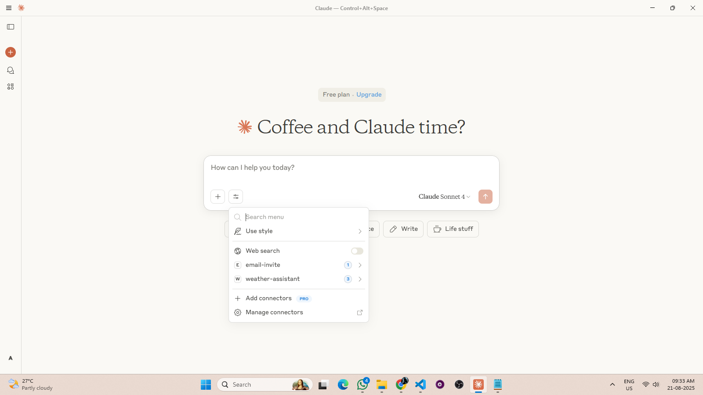

# Project Setup Guide

## 2. Set Up Virtual Environment

### 🔹 Windows
```bash
# Create virtual environment
python -m venv venv

# Activate virtual environment
venv\Scripts\activate
```

### 🔹 macOS/Linux
```bash
# Create virtual environment
python3 -m venv venv

# Activate virtual environment
source venv/bin/activate
```

## 3. Install Dependencies
Once the virtual environment is activated, install the required libraries:

```bash
pip install -r requirements.txt
```

## 4. Deactivate Virtual Environment
When you're done working, deactivate the environment:

```bash
deactivate
```

## 5. Reactivate Later
To start working again, simply activate the environment (Step 2) and you're ready to go.

## 6. Download and Install Claude Desktop

### 🔹 Windows
1. Visit the [Anthropic website](https://claude.ai/download)
2. Download the Windows installer (.exe file)
3. Run the installer and follow the setup wizard
4. Launch Claude Desktop from your Start menu or desktop shortcut

### 🔹 macOS
1. Visit the [Anthropic website](https://claude.ai/download)
2. Download the macOS installer (.dmg file)
3. Open the .dmg file and drag Claude to your Applications folder
4. Launch Claude from your Applications folder or Launchpad

### 🔹 Linux
1. Visit the [Anthropic website](https://claude.ai/download)
2. Download the appropriate Linux package (.deb, .rpm, or .AppImage)
3. Install using your package manager or run the AppImage directly
4. Launch Claude from your applications menu

## 7. Configure MCP Tools in Claude Desktop

### 🔹 Access MCP Configuration
1. Open Claude Desktop
2. Go to **Settings** (usually found in the menu or gear icon)
3. Navigate to **Advanced** section
4. Look for **MCP Tools** or **Model Context Protocol**

### 🔹 Configure MCP Tools
1. You will find a JSON configuration file for MCP tools
2. Add your MCP tool configurations to this JSON file
3. The JSON structure typically looks like:

```json
{
  "mcpServers": {
    "your-tool-name": {
      "command": "venv/Scripts/python.exe",
      "args": ["your_mcp_script.py"],
      "env": {
        "API_KEY": "your_api_key_value",
        "DATABASE_URL": "your_database_connection_string",
        "DEBUG_MODE": "true"
      }
    }
  }
}
```

### 🔹 Virtual Environment Python Path
- **Windows**: `venv/Scripts/python.exe`
- **macOS/Linux**: `venv/bin/python`

Make sure to use the correct path for your operating system when setting up the MCP tool configuration.

4. Save the configuration file
5. Restart Claude Desktop to apply the changes

✅ You now have your virtual environment set up, all dependencies installed, Claude Desktop ready to use, and MCP tools configured!



